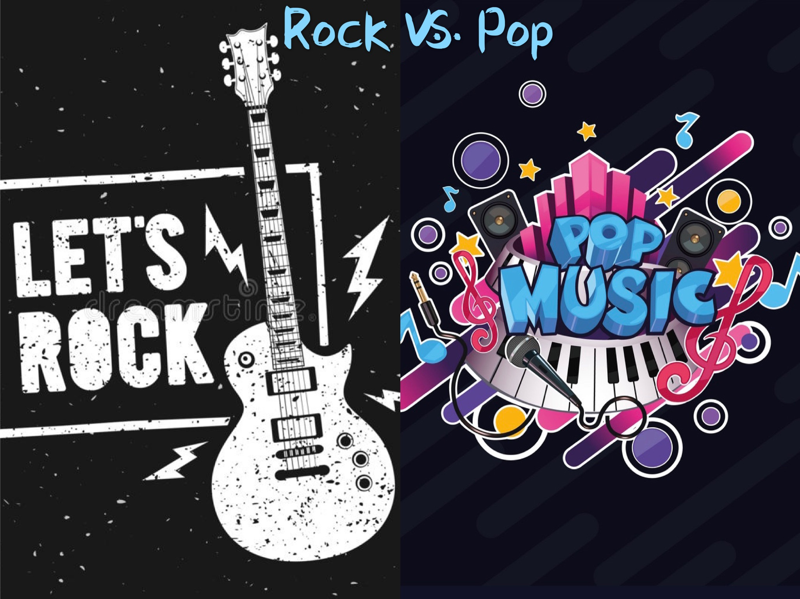

Music is everywhere in our daily life. People wearing headsets walking on the road is most likely to be listening to music. Background music would always pump up in movies, seires and other kinds of videos, also in large markets or shopping malls. The rhythms of music songs have the power to change the feelings of people, including palliating the mood of people or letting people be more joyful. But what are the singers talking about in the songs? In this report, the words in the songs of rock music and pop music are going to be analyzed to find out if there is any difference among them.

\pagebreak


```{r, echo=FALSE, warning=FALSE,message=FALSE}
# package loading
library("rvest")
library("tibble")
library("syuzhet")
library("sentimentr")
library("gplots")
library("dplyr")
library("tm")
library("syuzhet")
library("factoextra")
library("beeswarm")
library("scales")
library("RColorBrewer")
library("RANN")
library("tm")
library("topicmodels")
library("stringr")
library("ggplot2")
library("ggpubr")
library("tidytext")
library("textdata")
library("tidyr")
library("wordcloud")
library("reshape2")

```


## Which two classes of music is going to be analyzed?

In order to decide the two classes of music for analysis, the number of songs of each class of music published in every year is carefully studied. Also, in order to be more precise in describing the trend of each class of music, the proportion of songs is also ploted in year as below.

```{r,echo=FALSE,warning=FALSE,message=FALSE}
# load the initial dataset
load('../data/lyrics.RData') 

```


```{r,echo=FALSE, warning=FALSE,message=FALSE}
# compute the number of songs of each class published in each year
table.gen_year <- table(dt_lyrics$year,dt_lyrics$genre)
table.gen_year.clean <- table.gen_year[3:nrow(table.gen_year),]


year = sort(unique(dt_lyrics$year))
year = year[3:length(year)]

genre = sort(unique(dt_lyrics$genre))
gen = c()
for (i in genre) {
  for (j in 1:length(year)) {
    gen = c(gen,i)
  }
}


genre_year.df <- data.frame(year = rep(year,length(genre)),
                            freq = c(table.gen_year.clean[,1],table.gen_year.clean[,2],
                                     table.gen_year.clean[,3],table.gen_year.clean[,4],
                                     table.gen_year.clean[,5],table.gen_year.clean[,6],
                                     table.gen_year.clean[,7],table.gen_year.clean[,8],
                                     table.gen_year.clean[,9],table.gen_year.clean[,10],
                                     table.gen_year.clean[,11],table.gen_year.clean[,12]),
                            genre = gen)
```


```{r,echo=FALSE,warning=FALSE,message=FALSE}
# compute the proportion of songs of each class published in each year
table.gen_year.prop <- table.gen_year.clean
yearsum <- rowSums(table.gen_year.prop)
table.gen_year.prop<- cbind(table.gen_year.prop,yearsum)
for (i in 1:12) {
  for (j in 1:nrow(table.gen_year.prop)) {
    table.gen_year.prop[j,i] = table.gen_year.clean[j,i]/table.gen_year.prop[j,13]
  }
}


genre_year.prop.df <- data.frame(year = rep(year,length(genre)),
                                freq = c(table.gen_year.prop[,1],table.gen_year.prop[,2],
                                         table.gen_year.prop[,3],table.gen_year.prop[,4],
                                         table.gen_year.prop[,5],table.gen_year.prop[,6],
                                         table.gen_year.prop[,7],table.gen_year.prop[,8],
                                         table.gen_year.prop[,9],table.gen_year.prop[,10],
                                         table.gen_year.prop[,11],table.gen_year.prop[,12]),
                                genre = gen)

```

```{r,echo=FALSE,warning=FALSE,message=FALSE}

theme_update(plot.title = element_text(hjust = 0.5))
g1 <- ggplot(data = genre_year.df) +
  geom_line(mapping = aes(x = year, y = freq,color=genre))+
  labs(title = "Number of songs published in year", 
       x = "Year", y = "Number of songs",color="Percentile")


g2 <- ggplot(data = genre_year.prop.df) +
  geom_line(mapping = aes(x = year, y = freq,color=genre))+
  labs(title = "proportion of songs published in year", 
       x = "Year", y = "proportion of songs",color="Percentile")


ggarrange(g1,g2,common.legend=TRUE,legend = 'right')
```

From these two plots, it could be shown that there is a general trend of number of songs published as year go by, the fluctuation type being almsot the same. However, the plot of  porportion of songs published as year go by demonstrates more differences among different classes of music. THe proportion of songs of rock music seems to be decreasing while that of pop music is gradually increasing. Also, it is also shown that the number of rock music songs went up dramatically around 2006. There seems to be something hidden inside music songs of rock music and pop music. Therefore, these two types of music songs are going to be further studied and analyzed.

\pagebreak


## How do rock music songs differ from pop music songs?

In order to take a deep look on the difference between rock music and pop music, the length, words used and the sentiment that songs convey are to be studies further.

### The length of music songs.

In this part, the length of music songs is carefully studied. In order to see whether the length of songs is different between rock music songs and pop music songs, a boxplot of their song length is generated as below. The songs with length being larger than the maximun of the upper 5% of both genres are removed since they could be treated as outliers for both genres. This could be verified by measuring the different quantiles of the length of songs for both genres.

```{r,echo=FALSE,warning=FALSE,message=FALSE}
load('../output/processed_lyrics_rp.RData') 

```

```{r,echo=FALSE,warning=FALSE,message=FALSE}
dt_lyrics$words<-rep(NA,nrow(dt_lyrics))
words.list<-sapply(dt_lyrics$lyrics,strsplit,split=' ')
for (i in 1:length(dt_lyrics$words)) {
  dt_lyrics$words[i] <- length(words.list[[i]])
}

rock.per95 <- quantile(dt_lyrics[which(dt_lyrics$genre=="Rock"),]$words,0.95)
pop.per95 <- quantile(dt_lyrics[which(dt_lyrics$genre=="Pop"),]$words,0.95)
dt_lyrics.wordsoutrem <- dt_lyrics[which(dt_lyrics$words <= max(pop.per95,rock.per95)),]
dt_lyrics.wordsout <- dt_lyrics[which(dt_lyrics$words > min(pop.per95,rock.per95)),]


ggplot(dt_lyrics.wordsoutrem, aes(x = genre, y = words)) +
geom_boxplot(aes(fill = genre))

#ggplot(dt_lyrics.wordsout, aes(x = genre, y = words)) +
#geom_boxplot(aes(fill = genre))


```

From the boxplot above, it could be demostrated that the length of music songs of rock music and pop music is different, with length of pop songs being longer than that of rock music, although a small part of rock songs have longer lyrics. One possible reason for this phenomenon might be there would be a part called rap in some pop music songs, in which the artist of the song might prefer to sing the lyrics much faster than other parts of the song and express some feelings inside.


### The words in the songs

From the results produced above, the length of pop music songs appear to be longer than that of rock music songs. In this part of report, the words used in the songs of both genre are to be researched on, especially the pronouns used in the songs, which usually represent to be expressing some feeling inside songs. 

A function of count the frequency of the word required in the lyrics of a song is defined and is used to count the frequency of pronouns used in songs. The words of pronouns is characterized as: {I:i,i'm,i've,i'd},{YOU:you,you're,you've},{WE:we,we've},{THEY:they,they're, they've, them}.

```{r,echo=FALSE,warning=FALSE,message=FALSE}
# function of counting the word required in a text
word.freq<-function(word,df){
  words.list<-sapply(df$stemmedwords,strsplit,split=' ')
  count<-rep(NA,length(words.list))
  for (i in 1:length(words.list)){
    count[i] <- ifelse(word %in% words.list[[i]],
                       as.numeric(table(words.list[i])[word]/df[i,8]),0)
  }
  return (count)
}


## Count 'i','i've','i'm','you','you're','we','we've','they','they're','them' in lyrics
dt_lyrics$Icount<-word.freq('i',dt_lyrics)+word.freq('im',dt_lyrics)+word.freq('ive',dt_lyrics)+word.freq('id',dt_lyrics)
dt_lyrics$youcount<-word.freq('you',dt_lyrics)+word.freq('youre',dt_lyrics)+word.freq('youve',dt_lyrics)
dt_lyrics$wecount<-word.freq('we',dt_lyrics)+word.freq('weve',dt_lyrics)
dt_lyrics$theycount<-word.freq('they',dt_lyrics)+word.freq('theyre',dt_lyrics)+word.freq('theyve',dt_lyrics)+word.freq('them',dt_lyrics)

# decide the critical point of wecount and theycount
pop.we.per85 <- quantile(dt_lyrics[which(dt_lyrics$genre=="Pop"),]$wecount,0.85)
rock.we.per85 <- quantile(dt_lyrics[which(dt_lyrics$genre=="Rock"),]$wecount,0.85)
pop.they.per90 <- quantile(dt_lyrics[which(dt_lyrics$genre=="Pop"),]$theycount,0.9)
rock.they.per90 <- quantile(dt_lyrics[which(dt_lyrics$genre=="Rock"),]$theycount,0.9)

# plot the distribution of word count
p1<-ggplot(dt_lyrics)+
  geom_violin(aes(x=genre,y=Icount,fill=genre,color=genre),alpha=0.5)+
  labs(y='Frequency',title="Mentions of I")+
  theme(plot.title = element_text(hjust = 0.5))
p2<-ggplot(dt_lyrics)+
  geom_violin(aes(x=genre,y=youcount,fill=genre,color=genre),alpha=0.5)+
  labs(y='Frequency',title="Mentions of You")+
  theme(plot.title = element_text(hjust = 0.5))
p3<-ggplot(dt_lyrics[which(dt_lyrics$wecount<=max(pop.we.per85,rock.we.per85)),])+
  geom_violin(aes(x=genre,y=wecount,fill=genre,color=genre),alpha=0.5)+
  labs(y='Frequency',title="Mentions of We")+
  theme(plot.title = element_text(hjust = 0.5))
p4<-ggplot(dt_lyrics[which(dt_lyrics$theycount<=max(pop.they.per90,rock.they.per90)),])+
  geom_violin(aes(x=genre,y=theycount,fill=genre,color=genre),alpha=0.5)+
  labs(y='Frequency',title="Mentions of They")+
  theme(plot.title = element_text(hjust = 0.5))
ggarrange(p1,p2,p3,p4,common.legend=TRUE,legend = 'right')
```

The usage of pronouns of "I" and "You" are much more than that of "We" and "They" in both two music genres, expressing the feelings or experiences of two people. If we take a closer look at the shape of these plots, it could be seen that the usage of pronouns of "I", "You", "We" and "They" in pop music songs appears to be a bit more than that in rock music songs comparatively. 


Apart from the pronouns used in lyrics of songs, other words used would also be appropriate for analyzing the songs of both genre. Therefore, a word cloud is used here to see if there is any significant difference in the songs' lyrics of both genres.

```{r,echo=FALSE,warning=FALSE,message=FALSE}
# lyrics processing
dt.lyrics = dt_lyrics[,1:8]


tidy_lyrics <- dt.lyrics %>%
  unnest_tokens(word, stemmedwords)

# split data into different genres
tidy_lr.pop <- tidy_lyrics[which(tidy_lyrics$genre=="Pop"),]
tidy_lr.rock <- tidy_lyrics[which(tidy_lyrics$genre=="Rock"),]

```


```{r,echo=FALSE,warning=FALSE,message=FALSE}
par(mfrow=c(1,2))

# word cloud for pop music songs
tidy_lr.pop %>%
  inner_join(get_sentiments("bing")) %>%
  count(word, sentiment, sort = TRUE) %>%
  acast(word ~ sentiment, value.var = "n", fill = 0) %>%
  comparison.cloud(colors = c("gray20", "gray80"),
                   max.words = 100)

# word cloud for rock music songs
tidy_lr.rock %>%
  inner_join(get_sentiments("bing")) %>%
  count(word, sentiment, sort = TRUE) %>%
  acast(word ~ sentiment, value.var = "n", fill = 0) %>%
  comparison.cloud(colors = c("gray20", "gray80"),
                   max.words = 100)

par(mfrow=c(1,1))
```

From the two wordcoulds as shown abvoe (the first wordcloud plot is for pop music, the second wordcloud plot is for rock music), the proportion of negative and positive feelings seems to be almost the same in pop music and rock music. However, if a further look is taken to see the scale of the words in both wordcloud plots, it would be noticed that there is some difference in the scale of words between two plots. The words of "free" and "heaven" appears to be a little bit larger and darker in wordcloud for rock music than that for pop music. Also, the words in negative part of wordcloud plot of rock music is a little bit larger than that of pop music, meaning that negative feelings might be more often to be expressed in rock music songs than in pop music songs. 


### The sentiment in songs

As shown from the wordcloud plot of both two genres of music, the feelings expressed in both songs appear to be somehow different. In this part of report, sentiment analysis of lyrics of both genres is conducted. With the help of textdata package and the "bing" and "afinn" lexicons, the sentiment analysis produces the plot of sentiment classification of songs for both genres.

```{r,echo=FALSE,warning=FALSE,message=FALSE}
lyrics_sentiment <- tidy_lyrics %>%
  inner_join(get_sentiments("bing")) %>%
  count(song, index = genre, sentiment) %>%
  spread(sentiment, n, fill = 0) %>%
  mutate(sentiment = positive - negative)

lyrics.sentiment.rock <- lyrics_sentiment[which(lyrics_sentiment$index=="Rock"),]
lyrics.sentiment.pop <- lyrics_sentiment[which(lyrics_sentiment$index=="Pop"),]

lr.sentiment.index.rock <- sample(1:nrow(lyrics.sentiment.rock),300,replace = FALSE)
lr.sentiment.index.pop <- sample(1:nrow(lyrics.sentiment.pop),300,replace = FALSE)
lyrics_sentiment.sample <- rbind(lyrics.sentiment.rock[lr.sentiment.index.rock,],
                                 lyrics.sentiment.pop[lr.sentiment.index.pop,])


ggplot(lyrics_sentiment.sample, aes(song, sentiment, fill = index)) +
  geom_col(show.legend = FALSE) +
  facet_wrap(~index, ncol = 2, scales = "free_x")

```

The graph above shows the sentiment analysis produced by lexicon "bing", which count the words representing positive and negative feelings and compute by using "postive - negative" as final results of sentiment of the song. It is shown that more nagetive feelings are expressed in rock music, with line being downside of 0 much more in rock than in pop. Another thing that should be noticed from the plot above is that feelings are more openly expressed in pop music than in rock music, with the length of lines being longer for pop music than for rock music. 


```{r,echo=FALSE,warning=FALSE,message=FALSE}
lyrics_afinn <- tidy_lyrics %>% 
  inner_join(get_sentiments("afinn")) %>% 
  group_by(index = song,genre) %>% 
  summarise(sentiment = sum(value)) %>% 
  mutate(method = "AFINN")

lyrics.afinn.rock <- lyrics_afinn[which(lyrics_afinn$genre=="Rock"),]
lyrics.afinn.pop <- lyrics_afinn[which(lyrics_afinn$genre=="Pop"),]

lr.afinn.index.rock <- sample(1:nrow(lyrics.afinn.rock),300,replace = FALSE)
lr.afinn.index.pop <- sample(1:nrow(lyrics.afinn.pop),300,replace = FALSE)
lyrics_afinn.sample <- rbind(lyrics.afinn.rock[lr.afinn.index.rock,],
                                 lyrics.afinn.pop[lr.afinn.index.pop,])


ggplot(lyrics_afinn.sample, aes(index, sentiment, fill = genre)) +
  geom_col(show.legend = FALSE) +
  facet_wrap(~genre, ncol = 2, scales = "free_x")

```

This graph above shows the sentiment analysis produced by lexicon "afinn", which compute the sentiments of songs by weighting the words that express feelings differently and sum them up as final results of sentiment of the song. It is clearly shown that the feelings expressed in rock music are much more mild openly than in pop music, with the absolute value of the final sentiment value of pop music being much smaller than that of pop music. 


```{r,echo=FALSE,warning=FALSE,message=FALSE}

lyrics_bingcounts.pop <- tidy_lr.pop %>%
  inner_join(get_sentiments("bing")) %>%
  count(word, sentiment, sort = TRUE) %>%
  ungroup()


lyrics_bingcounts.pop %>%
  group_by(sentiment) %>%
  top_n(10) %>%
  ungroup() %>%
  mutate(word = reorder(word, n)) %>%
  ggplot(aes(word, n, fill = sentiment)) +
  geom_col(show.legend = FALSE) +
  facet_wrap(~sentiment, scales = "free_y") +
  labs(y = "Contribution to sentiment of Pop music",
       x = NULL) +
  coord_flip()

lyrics_bingcounts.rock <- tidy_lr.rock %>%
  inner_join(get_sentiments("bing")) %>%
  count(word, sentiment, sort = TRUE) %>%
  ungroup()


lyrics_bingcounts.rock %>%
  group_by(sentiment) %>%
  top_n(10) %>%
  ungroup() %>%
  mutate(word = reorder(word, n)) %>%
  ggplot(aes(word, n, fill = sentiment)) +
  geom_col(show.legend = FALSE) +
  facet_wrap(~sentiment, scales = "free_y") +
  labs(y = "Contribution to sentiment of Rock music",
       x = NULL) +
  coord_flip()
```

These two graphs shown above demonstrates the frequency of words that used in the lyrics of songs that contribute to the different kind of sentiment. "Love" is the word used most in both genres that contributes to positive sentiment. The usage of negative words in rock music is shown to be much more than that in pop music, which is align with the findings of sentiment analysis using "bing".

### Short conlusion

Nowadays, people often think of pop music as a way of expressing inside feelings through songs and is often using rap part in pop songs to more directly express the feelings without the constraint of the rhythms. The sentiment expressed in rock music songs is often more likely to be negative and is expressed milder than pop music songs. This might be some of the reason that the proportion of pop music published every year is gradually incresing.


## Summary

By analyzing the lyrics of pop music songs and rock music songs, the following results could be obtained:

1. The pop music songs have longer lyrics than the rock music songs.

2. The feeling inside songs are more openly expressed in pop music songs than in rock music songs.

3. Negative sentiments are more commonly seen in rock music songs than in pop music songs.


## References

Julia Silge and David Robinson. Text Mining with R. 2019.


